# Optimize an AI agent in minutes with Foundry Agent Optimizer

[](https://ai.azure.com)
[](https://aka.ms/ao/docs)
[](https://aka.ms/azd)
[](https://www.python.org/)
[](../LICENSE)

> We build a **customer support agent**, deploy it to **Foundry Agent Service** and let
> **Agent Optimizer** improve its instructions and model on its own. No retraining, no code changes.
> This single README gathers the **article**, the **hands-on guide**, the **real output captures**
> and the **v1 → v20 journey**.

```
$ azd ai agent optimize

Results:
  Candidate              Score        Pass
  ──────────────────── ──────────── ──────
  baseline                 0.77       71%
  candidate_1 ★            0.84      100%
  candidate_2              0.81       88%

  Deploy the best candidate:
    azd ai agent optimize apply --candidate cand_9cb87381f…
```

From 71% to 100% of cases passing without writing a single new line of code.

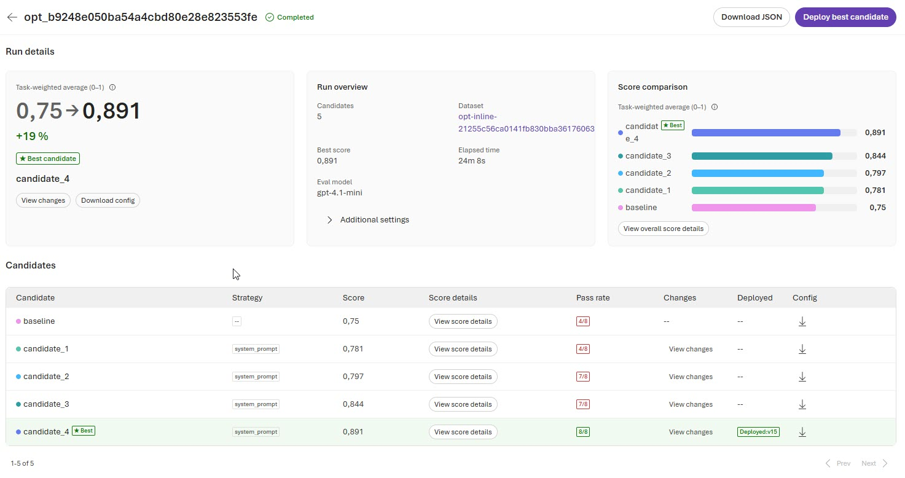
*The same optimization run in the Foundry portal: the candidate ranking and the winning score, exactly what the CLI prints above.*

---

## Table of contents

- [Part 1 — The article](#part-1--the-article)
  - [The problem we've all suffered](#the-problem-weve-all-suffered)
  - [The idea in one picture](#the-idea-in-one-picture)
  - [Why this matters](#why-this-matters)
  - [Adapt it to your case](#adapt-it-to-your-case)
- [Part 2 — Hands-on guide](#part-2--hands-on-guide)
  - [What this example includes](#what-this-example-includes)
  - [Prerequisites](#prerequisites)
  - [Step by step](#step-by-step)
  - [Quick command reference](#quick-command-reference)
  - [How the optimization works](#how-the-optimization-works)
  - [Observability & telemetry](#observability--telemetry--what-you-can-see-and-why)
- [Part 3 — Real output captures](#part-3--real-output-captures)
  - [1. Provision the infrastructure — `azd provision`](#1-provision-the-infrastructure--azd-provision)
  - [2. Deploy the agent — `azd deploy`](#2-deploy-the-agent--azd-deploy)
  - [3. Test the baseline — `azd ai agent invoke`](#3-test-the-baseline--azd-ai-agent-invoke)
  - [4. Run the optimization — `azd ai agent optimize`](#4-run-the-optimization--azd-ai-agent-optimize)
  - [5. Apply the winner — `azd ai agent optimize apply`](#5-apply-the-winner--azd-ai-agent-optimize-apply)
  - [6. Deploy the optimized agent — `azd deploy`](#6-deploy-the-optimized-agent--azd-deploy)
  - [7. Test the optimized agent — `azd ai agent invoke`](#7-test-the-optimized-agent--azd-ai-agent-invoke)
  - [Cycle summary](#cycle-summary)
- [Part 4 — The journey from version 1 to version 20](#part-4--the-journey-from-version-1-to-version-20)
  - [TL;DR](#tldr)
  - [1. Why there are 20 versions](#1-why-there-are-20-versions)
  - [2. The original blocker (v1)](#2-the-original-blocker-v1)
  - [3. The fix: container deployment (v2 – v19)](#3-the-fix-container-deployment-v2--v19)
  - [4. The optimization cycle (from baseline v19 to optimized v20)](#4-the-optimization-cycle-from-baseline-v19-to-optimized-v20)
  - [5. Version lifecycle](#5-version-lifecycle)
  - [6. What changed between the baseline (v19) and the optimized one (v20)](#6-what-changed-between-the-baseline-v19-and-the-optimized-one-v20)
  - [7. Lessons from the journey](#7-lessons-from-the-journey)
- [Resources](#resources)

---

# Part 1 — The article

## The problem we've all suffered

You have an agent that *works*… more or less. Sometimes it answers beautifully and sometimes it
makes up policies that don't exist. So you fall into a familiar loop: you tweak a sentence in the
*prompt*, test it with four hand-picked examples, decide it looks better, ship it… and the next
week you start over. Improving an agent "by eye" is slow, subjective and doesn't scale.

**Agent Optimizer** automates that loop. You give it a starting point (the *baseline*), a set of
test cases and some quality criteria, and it generates better variants, evaluates them with data
and ranks them by score. You just deploy the winner.

## The idea in one picture

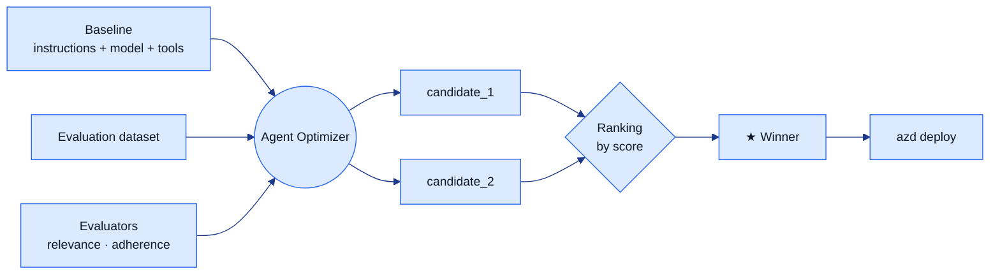

The technical key: the agent reads its configuration with `load_config()`, from the
`azure-ai-agentserver-optimization` package. That's why the optimizer can try dozens of variants
**without modifying `main.py`** — it only changes the *baseline* configuration files.

## Why this matters

- **Objective, not by eye.** Decisions are based on a score over real cases, not on the hunch of
  whoever last touched the *prompt*.
- **Reproducible.** The *baseline*, the dataset and the evaluators live in the repo and go into
  *git*. Anyone can repeat the experiment.
- **No retraining.** No GPUs, no fine-tuning, no hours of waiting. Just better instructions, tools
  and model selection.

## Adapt it to your case

| You want… | Change… |
|-----------|---------|
| Another domain (HR, banking, devops…) | [instructions.md](src/support-agent/.agent_configs/baseline/instructions.md) and your tool in [main.py](src/support-agent/main.py) |
| Your own test cases | [support-eval.jsonl](src/support-agent/data/support-eval.jsonl) |
| Other quality criteria | the `evaluators` list in [eval.yaml](src/support-agent/eval.yaml) |
| Try another model | `optimization_config.model` in [eval.yaml](src/support-agent/eval.yaml) |

---

# Part 2 — Hands-on guide

## What this example includes

```
├─ README.md                         ← this document (article + guide + captures + journey)
├─ azure.yaml                        ← azd project definition (infra + agent service)
├─ infra/
│  ├─ main.bicep                     ← infrastructure (Foundry, model, ACR, App Insights)
│  └─ main.parameters.json           ← deployment parameters
└─ src/
   └─ support-agent/
      ├─ main.py                     ← agent code (hosted agent in Python)
      ├─ agent.yaml                  ← agent manifest for Foundry
      ├─ Dockerfile                  ← container image (required by the optimizer)
      ├─ requirements.txt            ← dependencies (includes the optimization SDK)
      ├─ eval.yaml                   ← Agent Optimizer configuration
      ├─ .agent_configs/
      │  └─ baseline/                ← starting point that the optimizer improves
      │     ├─ metadata.yaml
      │     ├─ instructions.md
      │     └─ tools.json
      └─ data/
         └─ support-eval.jsonl       ← evaluation dataset (test cases)
```

## Prerequisites

- [ ] **Azure subscription allowlisted** for the Agent Optimizer private preview.
- [ ] [Azure CLI](https://learn.microsoft.com/cli/azure/install-azure-cli) installed.
- [ ] [azd CLI](https://aka.ms/azd) installed.
- [ ] [Python 3.12+](https://www.python.org/downloads/).
- [ ] A container engine ([Docker Desktop](https://www.docker.com/products/docker-desktop/) or
      [Podman](https://podman.io/)). The optimizer **deploys the agent as a container image**, so a
      working `docker` (or a `docker`-compatible shim) is required to build and push the image.

> ⚠️ **Region:** use **East US 2** (`eastus2`). North Central US does **not** support Agent. Service in this preview, so keep the workload in `eastus2`.

> ⚠️ **Container deployment is mandatory.** Agent Optimizer rejects ZIP / `code_configuration` deployments. The agent ships with a `Dockerfile` and the infra provisions an Azure Container. Registry; `azd` builds and pushes the image automatically.
>
> ℹ️ **ZIP deployment is not supported yet.** Today the hosted agent must be deployed as a container image. Support for **ZIP-deployed hosted agents** is on the roadmap and expected in an upcoming release; once available, the `Dockerfile` + Container Registry requirement will become optional.

## Step by step

### Step 1 — Install the azd agents extension

```bash
azd extension install azure.ai.agents
azd ai agent --help   # verify the installation
```

### Step 2 — Authenticate

```bash
az login
azd auth login
```

### Step 3 — Move into the example

```bash
cd example-agent-optimizer-en
```

### Step 4 — Configure the azd environment

```bash
azd env new support-demo
azd env set AZURE_SUBSCRIPTION_ID $(az account show --query id -o tsv)
azd env set AZURE_LOCATION eastus2
```

### Step 5 — Provision the infrastructure

Creates the Foundry project, the model deployment, the Azure Container Registry, Log Analytics and
Application Insights defined in [`infra/main.bicep`](infra/main.bicep).

```bash
azd provision    # ~1.5 min
```

### Step 6 — Deploy the agent

```bash
azd deploy       # ~2 min — builds the container image, pushes it to ACR and registers the hosted agent
```

### Step 7 — Try it

```bash
azd ai agent invoke support-agent "Hi, what's the return policy?"
```

### Step 8 — Run your first optimization 🚀

```bash
azd ai agent optimize
```

This evaluates the **baseline**, generates candidates with better instructions/model and ranks
them. A typical run takes between 5 and 20 minutes.

### Step 9 — Deploy the winner

```bash
# Review the changes locally before deploying (recommended):
azd ai agent optimize apply --candidate <candidate-id>
git diff                         # review the new baseline
azd deploy

# Or deploy the candidate directly:
azd ai agent optimize deploy --candidate <candidate-id>
```

### Step 10 — Clean up when you're done

```bash
azd down
```

## Quick command reference

| Command | Description |
|---------|-------------|
| `azd ai agent init` | Create a new agent project |
| `azd provision` | Provision the infrastructure in Azure |
| `azd deploy` | Deploy the agent to Foundry |
| `azd ai agent invoke <name> "prompt"` | Test the deployed agent |
| `azd ai agent optimize` | Run the optimization (baseline + candidates) |
| `azd ai agent optimize --eval` | Evaluate only the baseline |
| `azd ai agent optimize apply --candidate <id>` | Apply the candidate locally to review it |
| `azd ai agent optimize deploy --candidate <id>` | Deploy a winning candidate |
| `azd ai agent optimize status <id> --watch` | Watch the optimization progress |
| `azd down` | Delete every resource |

## How the optimization works

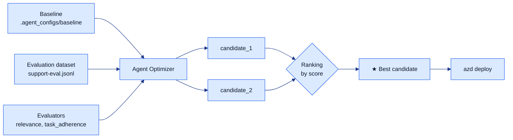

1. The **baseline** ([`.agent_configs/baseline/`](src/support-agent/.agent_configs/baseline/)) defines
   the starting point: instructions, model and tools.
2. The **dataset** ([`support-eval.jsonl`](src/support-agent/data/support-eval.jsonl)) contains
   test cases with the expected answer.
3. The **evaluators** score each answer (relevance, task adherence, etc.).
4. Agent Optimizer generates candidates, evaluates them against the dataset and **ranks** them.
5. You deploy the highest-scoring candidate.

> The agent reads its configuration with `load_config()` (from the
> `azure-ai-agentserver-optimization` package). That's why the optimizer can try variants
> **without touching the code** in [`main.py`](src/support-agent/main.py).

### The three models involved (and who does what)

This is the part that confuses everyone the first time. The optimization configuration
([`eval.yaml`](src/support-agent/eval.yaml)) references **three different model roles** — and they
are *not* the same thing. Read this once and it clicks forever:

```yaml
agent:
  model: gpt-4.1-mini            # 1) THE WORKER — the model the agent runs on
options:
  eval_model: gpt-4.1-mini       # 2) THE JUDGE — scores each answer
  optimization_model: GPT-5.1    # 3) THE WRITER — rewrites the instructions
```

| Role in `eval.yaml` | Model | What it actually does |
| --- | --- | --- |
| **`agent.model`** — *the worker* | `gpt-4.1-mini` | The cheap model the **agent runs on**, in the baseline **and** in production. This never changes. |
| **`eval_model`** — *the judge* | `gpt-4.1-mini` | **Grades** every answer with the evaluators (`relevance`, `task_adherence`) and produces the score (0–1). |
| **`optimization_model`** — *the writer* | `GPT-5.1` | The expensive, smart model that **rewrites and improves the instructions**. It is the brain of the optimization. |

**The mental model — think of a support team:**

- 🧠 **`optimization_model` (GPT-5.1) is the senior Product Manager.** It takes the rough, 9-line
  baseline prompt and rewrites it into a polished, 212-line playbook. It writes the *manual* — it
  does **not** answer customers and it does **not** grade the exam.
- 📋 **`eval_model` (gpt-4.1-mini) is the teacher grading the exam.** It marks every answer against
  the dataset and gives the score that drives the ranking.
- 🧑‍💼 **`agent.model` (gpt-4.1-mini) is the junior agent answering customers.** Cheap and fast —
  but now armed with the excellent manual the PM wrote.

> **The key takeaway:** GPT-5.1 does **not** evaluate your agent, and your agent does **not** run on
> GPT-5.1. You pay for the expensive model **once** (during optimization, to *write* the best
> possible instructions), and in production you keep running on the **cheap** `gpt-4.1-mini` — just
> with far better instructions. Best of both worlds: premium-quality prompting, budget-friendly
> runtime.

The other options round out the loop: `max_iterations: 4` lets the writer refine up to four rounds,
and `optimization_config.model` lists the candidate models the optimizer is *allowed* to try for the
agent (here we keep it simple and only allow `GPT-5.1`).

## Observability & telemetry — what you can see and why

Every invocation of the agent is fully traced end-to-end. The infrastructure provisions an
**Application Insights** resource backed by a **Log Analytics** workspace
([`infra/resources.bicep`](infra/resources.bicep)), and the Foundry project is wired to it through an
`AppInsights` **project connection**. You don't write any telemetry code: the Foundry Hosted Agents
runtime detects that connection and **auto-configures Azure Monitor / OpenTelemetry inside the
container** (the startup logs confirm it with `appinsights_configured=True`).

> ⚠️ **Do not call `configure_azure_monitor()` yourself.** Because the platform already initializes
> OpenTelemetry, a second manual init double-instruments the runtime and **crashes the container on
> startup** (`session_creation_failed` / HTTP 500). [`main.py`](src/support-agent/main.py) therefore
> only configures the agent — telemetry is left to the platform. The single env var
> `AZURE_EXPERIMENTAL_ENABLE_GENAI_TRACING=true` in [`agent.yaml`](src/support-agent/agent.yaml) is
> what enriches the traces with the model/tool spans below.

### What is monitored

| Signal | Where it lands | What it tells you |
| --- | --- | --- |
| **Requests** | `AppRequests` → `invoke_agent` | Each inbound call to the agent: latency, success/failure, request id. |
| **Model calls** | `AppDependencies` → `chat gpt-4.1-mini` | Every call to the worker model — the actual LLM round-trips (and their timing). |
| **Tool calls** | `AppDependencies` → `execute_tool lookup_policy` | When and how the agent uses your tools (here, the policy lookup). |
| **Foundry storage** | `AppDependencies` → `.../storage/responses`, `.../storage/history/...` | Conversation persistence (the Responses protocol reading/writing history). |
| **Identity** | `AppDependencies` → `GET /msi/token`, `GET /metadata/instance/compute` | Managed-identity token acquisition — useful to spot auth issues. |
| **Detailed traces** | `AppTraces` | The full step-by-step log of every turn: user message, tool arguments, tool result, assistant reply, durations. |

### Why it matters

- **Debugging** — when an answer is wrong, `AppTraces` shows the exact tool arguments and the model's
  reasoning steps, so you can see *why* it answered the way it did (e.g. the agent calling
  `lookup_policy` and getting a "no info, hand off to human" result).
- **Latency & cost** — `AppDependencies` separates model time from tool time from storage time, so
  you know where the seconds (and the tokens) go before and after an optimization.
- **Closing the loop with the optimizer** — the same evaluators that score candidates also benefit
  from real traces: you can compare baseline vs. optimized behaviour with production evidence, not
  guesses.

### See it yourself

In the **Foundry portal**, open your agent → **Tracing / Monitoring** tab to browse spans visually.
The **Traces** tab lists every invocation with its duration, token usage and estimated cost:

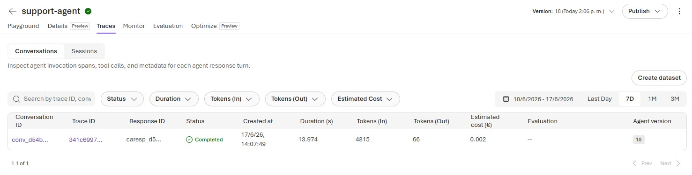

Click any trace to open the **trajectory** — the full span tree of a single turn, showing the agent
invocation, the model (`chat gpt-4.1-mini`) and tool (`execute_tool lookup_policy`) spans, the HTTP
calls and the per-span metadata:

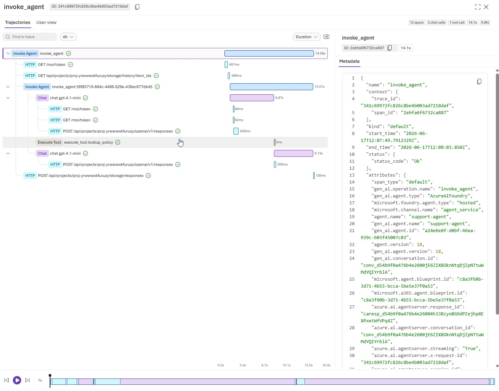

Prefer KQL? Query the Log Analytics workspace directly:

```kusto
// Recent agent invocations (requests)
AppRequests
| where Name == "invoke_agent"
| project TimeGenerated, DurationMs, Success, OperationId
| order by TimeGenerated desc

// Model and tool calls for a session
AppDependencies
| where Name startswith "chat " or Name startswith "execute_tool "
| project TimeGenerated, Name, DurationMs, OperationId
| order by TimeGenerated desc
```

> ℹ️ First data after a fresh deploy can take **2–5 minutes** to appear (Application Insights
> ingestion), and the very first invocation on a new version may return a one-off cold-start error —
> just retry.

---

# Part 3 — Real output captures

> Real outputs captured during the optimization session of the **support agent**
> (*Azure MVP Subscription - Prod*, region **eastus2**, 2026-06-16).
> The resource identifiers (`acrndysoumiexody`, `aisvc-ndysoumiexody`, `proj-ndysoumiexody`) are the
> real ones from the `support-demo` environment.

## 1. Provision the infrastructure — `azd provision`

Creates the resource group, the Foundry account (AI Services), the project, the model deployments
(`gpt-4.1-mini` + `gpt-5.1`), the **Azure Container Registry** and observability.

```console
$ azd provision

Provisioning Azure resources (azd provision)
Provisioning Azure resources can take some time.

  (✓) Done: Resource group: rg-support-demo
  (✓) Done: Container Registry: acrndysoumiexody (6.357s)
  (✓) Done: Log Analytics workspace: log-ndysoumiexody
  (✓) Done: Application Insights: appi-ndysoumiexody
  (✓) Done: Azure AI Services: aisvc-ndysoumiexody
  (✓) Done: Azure AI Project: proj-ndysoumiexody

SUCCESS: Your application was provisioned in Azure in 1 minute 23 seconds.
```

> 💡 **Key:** the ACR is mandatory. Agent Optimizer **does not accept** ZIP deployments; the agent
> must be published as a **container image**.

## 2. Deploy the agent — `azd deploy`

`azd` builds the image from the `Dockerfile`, pushes it to the ACR and registers the hosted agent.

```console
$ azd deploy

Deploying services (azd deploy)

  (✓) Done: Deploying service support-agent
  - Building container image...
  - Pushing image to acrndysoumiexody.azurecr.io...
  - Registering hosted agent (support-agent)...

SUCCESS: Your application was deployed to Azure in 2 minutes 1 second.
```

## 3. Test the baseline — `azd ai agent invoke`

```console
$ azd ai agent invoke support-agent "Hi, what's the return policy?"

Per our policy, we accept returns within 30 days of purchase, as long as you
keep the receipt and the original packaging.
```

The same agent is available in the **Foundry portal playground**, where you can chat with it and
follow every request live in the **Log stream** (traces, telemetry, model calls):

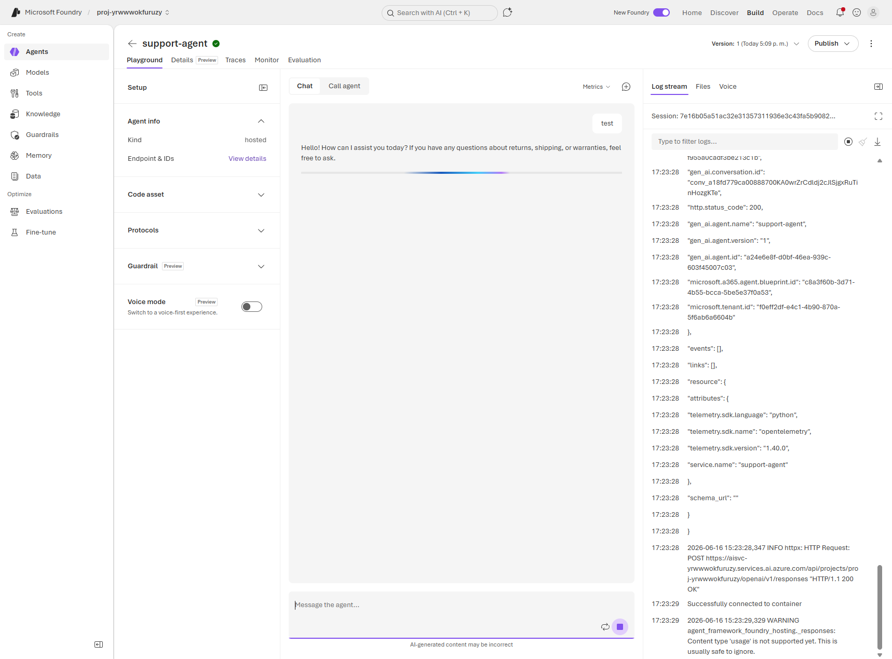
*The deployed `support-agent` (hosted, version 1) running in the Foundry portal. On the right, the
Log stream shows the OpenTelemetry traces of each invocation.*

## 4. Run the optimization — `azd ai agent optimize`

Evaluates the *baseline* against the dataset, generates candidates driven by **GPT-5.1** and ranks
them.

```console
$ azd ai agent optimize

Submitting optimization job...
Job ID: opt_7e917f9f82f442428aaf3e5245736bde
Status: queued -> in_progress -> succeeded
```

### Optimization result — `azd ai agent optimize status`

```console
$ azd ai agent optimize status opt_7e917f9f82f442428aaf3e5245736bde

Status: succeeded
Best score: 0.84

  Candidate        Score        Strategy          ID
  ──────────────── ──────────── ───────────────── ──────────────────────────────────────
  baseline             0.77      —                 cand_40a9672e7deb41229704be5067ccbc30
  candidate_1 ★        0.84      system_prompt     cand_9cb87381fcdc44a7b41d43a986dad175
  candidate_2          0.81      system_prompt     cand_80e6d19a995f4ec1833c0cd3ecbf7f26
```

The optimizer improved the agent from **0.77 → 0.84** by rewriting the *system prompt*. Without
touching `main.py` and without retraining anything.

### The same run, seen in the Foundry portal

Everything the CLI reports is also visible in the portal under **Optimize → Evaluations**. Each
optimization run creates an evaluation group you can open to inspect the scores per evaluator:

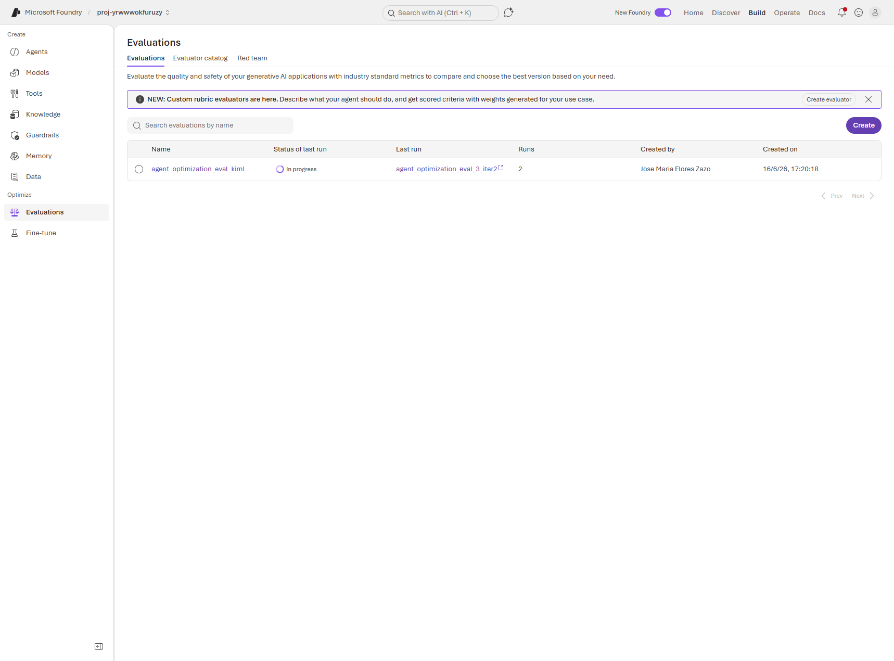
*The `Optimize → Evaluations` view: each optimization job shows up here with its status and run
count.*

Opening the evaluation shows the **per-run scores** for each evaluator — exactly the `relevance` and
`task_adherence` metrics declared in [`eval.yaml`](src/support-agent/eval.yaml):

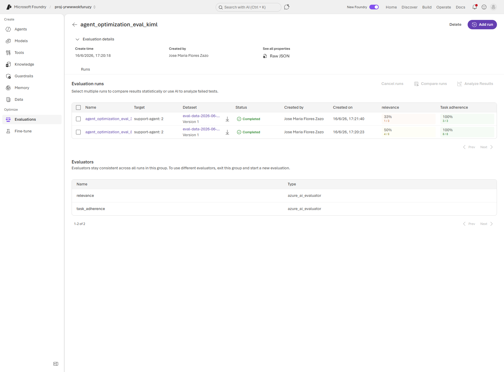
*Evaluation runs with the `relevance` and `task_adherence` columns (both `azure_ai_evaluator`). This
is the portal counterpart of the score table the CLI prints.*

The evaluation datasets are tracked too, under **Data → Datasets** — including the inline dataset the
optimizer auto-creates for each job:

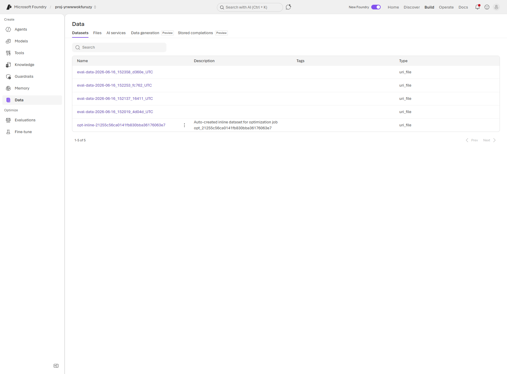
*The `Data → Datasets` view: the versioned `eval-data-*` snapshots plus the `opt-inline-*` dataset
auto-created for the optimization job.*

## 5. Apply the winner — `azd ai agent optimize apply`

Updates `agent.yaml` and writes the new configuration to `.agent_configs/<candidate-id>/`.

```console
$ azd ai agent optimize apply --candidate cand_9cb87381fcdc44a7b41d43a986dad175

Applying candidate cand_9cb87381fcdc44a7b41d43a986dad175...

  instructions.md   baseline:   9 lines  (  351 characters)
                    optimized: 60 lines  ( 4089 characters)

  (✓) agent.yaml updated
  (✓) .agent_configs/cand_9cb87381fcdc44a7b41d43a986dad175/ created
```

The instructions go from a short paragraph to a structured *prompt* with goal, mandatory use of the
`lookup_policy` tool, response strategy and constraints.

## 6. Deploy the optimized agent — `azd deploy`

```console
$ azd deploy --service support-agent

  (✓) Done: Deploying service support-agent
  - Rebuilding image with optimized instructions...
  - Registering hosted agent version 20...

SUCCESS: Your application was deployed to Azure in 1 minute 41 seconds.
```

The optimized agent becomes active as **version 20**.

## 7. Test the optimized agent — `azd ai agent invoke`

```console
$ azd ai agent invoke support-agent "How many days do I have to return a product and how do I start the return?"

[first byte: 6.761s]

Per our policy, you have 30 days from purchase to return a product, as long as
you have the receipt and the original packaging. To start the return, the policy
I checked doesn't include that detail. If you'd like, I can hand you over to a
human agent to guide you through the exact process.

[total: 19.825s]
```

Correct answer: it gives the concrete data (30 days, receipt, original packaging) and, when the
policy does **not** cover something (the exact procedure), it admits it honestly and offers to hand
off to a human. That's exactly what the `task_adherence` evaluator rewards.

## Cycle summary

| Step | Command | Result |
|------|---------|--------|
| Provision | `azd provision` | RG + Foundry + ACR + models (1m23s) |
| Deploy | `azd deploy` | Image → ACR → hosted agent (2m01s) |
| Optimize | `azd ai agent optimize` | `succeeded`, best 0.84 |
| Status | `azd ai agent optimize status` | baseline 0.77 → candidate_1 ★ 0.84 |
| Apply | `azd ai agent optimize apply` | Instructions 9 → 60 lines |
| Deploy | `azd deploy` | **Version 20** active (1m41s) |
| Test | `azd ai agent invoke` | Correct answer via `lookup_policy` |

---

# Part 4 — The journey from version 1 to version 20

> How we went from an agent that **couldn't be optimized** (v1) to the optimized, validated version
> (v20). Each `azd deploy` registers an **immutable version** of the hosted agent, so the version
> number is, literally, our attempt counter.

## TL;DR

| Milestone | Version | What happened |
|-----------|:------:|---------------|
| First deploy | **v1** | Agent deployed as **ZIP** → the optimizer rejects it |
| Unblocking | v2 – v18 | Dockerfile + ACR + Podman: switch the deployment to **container** |
| Optimizable baseline | v19 | The agent runs as an image; `optimize` works |
| Optimized agent | **v20** | Winning candidate applied (0.84) and deployed ✅ |

The quality jump: **0.77 → 0.84** by rewriting only the *system prompt*, without touching `main.py`.

## 1. Why there are 20 versions

In Foundry Agent Service, **every deployment creates a new, immutable version** of the agent. The
previous one isn't overwritten: it's stacked. During this project we had to iterate quite a bit to
unblock the optimizer, and each redeploy added a version. The versions aren't "failures": they are
the reproducible history of how the agent evolved.

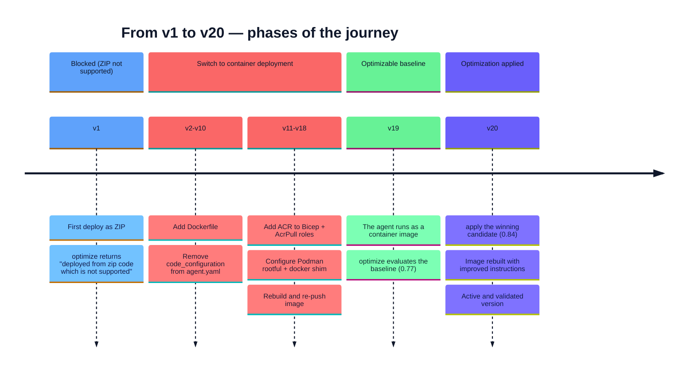

## 2. The original blocker (v1)

The first version was deployed as a **ZIP** package (with `code_configuration` in `agent.yaml`).
The agent *started*, but when launching the optimization:

```text
ERROR: agent 'support-agent' was deployed from zip code which is not supported
```

Agent Optimizer **requires** the agent to be a **container image**, so it can rebuild it with each
configuration variant. That was the wall we hit at v1.

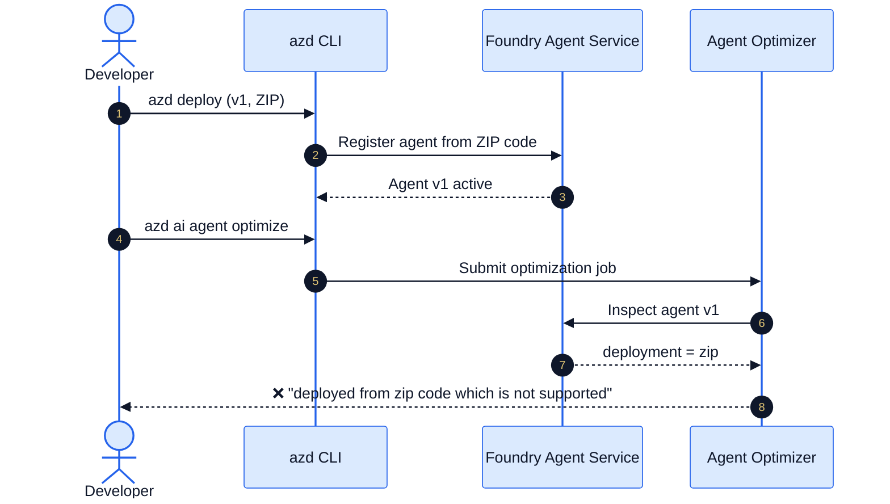

## 3. The fix: container deployment (v2 – v19)

To get the optimizer to accept the agent, we changed the deployment model from **ZIP** to
**container image**. Three pieces:

1. **`Dockerfile`** next to `main.py` — `azd` auto-detects it and builds the image.
2. **Remove `code_configuration`** from `agent.yaml` — so `azd` doesn't repackage as ZIP.
3. **Azure Container Registry** in the Bicep + `AcrPull` roles for the project/account identities —
   so the agent service can pull the image.

And, locally, a working container engine (**Podman rootful** with a `docker` shim) to build and push
the image.

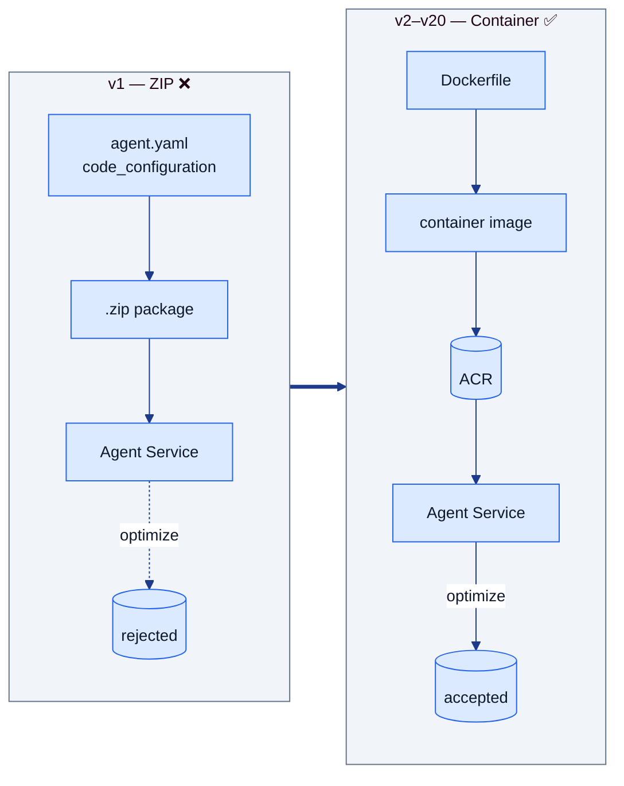

Each adjustment (Dockerfile, ACR, Podman configuration, image rebuild) meant a new `azd deploy` →
and therefore a new version. That's how we reached **v19**, with the agent already running as a
container and `optimize` working end to end.

## 4. The optimization cycle (from baseline v19 to optimized v20)

With the agent now optimizable, we ran the full Agent Optimizer cycle:

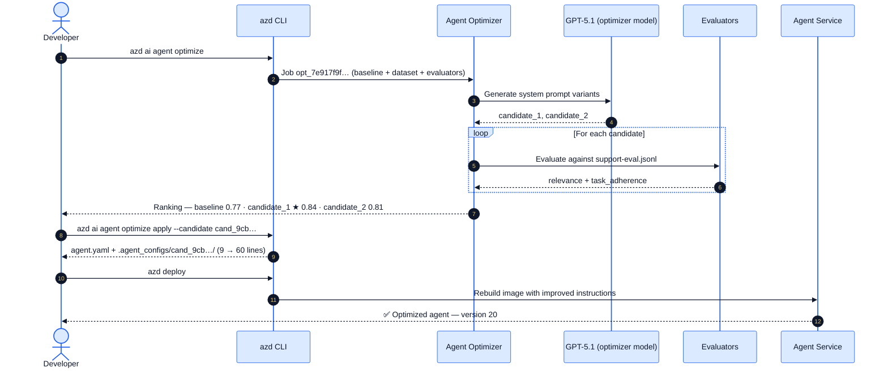

## 5. Version lifecycle

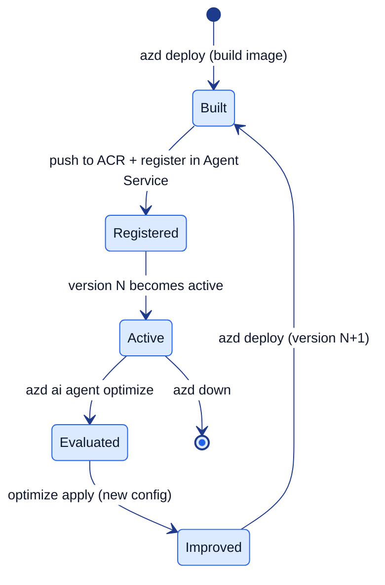

Each turn of this cycle increments the version number. That's why the final optimized version is
**20**: it's the cumulative result of all the deployment iterations plus the optimizer's improvement.

## 6. What changed between the baseline (v19) and the optimized one (v20)

The optimizer didn't touch the code: it only rewrote the **instructions** (the *system prompt*).

| | Baseline (v19) | Optimized (v20) |
|--|----------------|------------------|
| Length | 9 lines / 351 characters | 60 lines / 4089 characters |
| Structure | A generic paragraph | Goal, mandatory tool, response strategy, examples, constraints |
| Use of `lookup_policy` | "use it" | Step by step: which topic to look up, how to read the result, what to do if data is missing |
| Score | **0.77** | **0.84** |

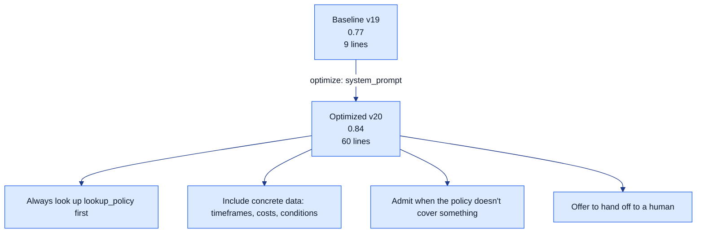

### The actual before / after

This is the real change the optimizer made. Strategy `system_prompt`: it rewrote **only**
[`instructions.md`](src/support-agent/.agent_configs/baseline/instructions.md) — same model
(`gpt-4.1-mini`), same `lookup_policy` tool, same code.

**Before — baseline (0.77):**

```text
You are a customer support agent for an online store.

You answer questions about returns, shipping and warranties. Use the
`lookup_policy` tool to check the official policy before answering.

- Be clear and concise.
- If you don't have the information, say so and offer to hand off to a human agent.
- Always answer in English.
```

**After — winning candidate (0.84):** a structured prompt with explicit blocks
([`GOAL`, `MANDATORY TOOL`, `RESPONSE STRATEGY`, `EXAMPLES`, `CONSTRAINTS`, `FINAL REMINDER`](src/support-agent/.agent_configs/cand_9cb87381fcdc44a7b41d43a986dad175/instructions.md)).

### Why the new version wins

The optimizer evaluated the baseline against the dataset, found *where* it failed, and fixed each gap
with an explicit rule:

| Baseline weakness | What the optimizer added | Why the score goes up |
|-------------------|--------------------------|-----------------------|
| "Use `lookup_policy`" was vague/optional | **"ALWAYS use `lookup_policy` before a final answer"** + numbered steps | `task_adherence` rewards always grounding the answer in the policy |
| No guidance on *how* to search | Concrete `topic` examples: `"express shipping"`, `"international shipping"`… | More precise lookups → the right data is retrieved → relevant answer |
| Didn't require concrete data | **"whenever the policy gives costs/timeframes/conditions, you must include them"** | `relevance` rewards exact data (e.g. "30 days", "$X") |
| "If no info, say so" was generic | Explicit rule: **don't invent**, say it's not there, **offer human hand-off** | Avoids hallucinations — heavily penalized by both evaluators |
| No response format | Template: answer first → nuances → close/hand-off | Consistent, well-structured answers |

In one line: **the baseline trusted the model to "behave"; the optimized prompt spells everything out**
— always check the policy, always give the concrete figure, never make it up. That is exactly what the
`relevance` and `task_adherence` evaluators measure, which is why pass rate jumps from **71% to 100%**.

## 7. Lessons from the journey

- **The versions tell the story.** Don't delete the intermediate ones: they document how and why the
  agent evolved.
- **The optimizer requires a container.** ZIP won't do; plan the `Dockerfile` and the ACR from the
  start.
- **Improving the *prompt* is measurable.** Going from 0.77 to 0.84 wasn't "by eye": the evaluator
  decided it over real cases.
- **Reproducible and cheap.** No GPUs, no fine-tuning. Just better instructions, evaluated with data.

---

## Resources

| Resource | Link |
|----------|------|
| Quickstart (15 min) | [aka.ms/ao/quickstart](https://aka.ms/ao/quickstart) |
| Concepts and overview | [aka.ms/ao/docs](https://aka.ms/ao/docs) |
| Customer support sample | [aka.ms/faos/samples](https://aka.ms/faos/samples) |
| Build 2026 announcement | [Agent Optimizer at Build 2026](https://devblogs.microsoft.com/foundry/agent-optimizer-build2026/) |
| Video demo | [YouTube](https://www.youtube.com/watch?v=_8UKz197JuM) |
