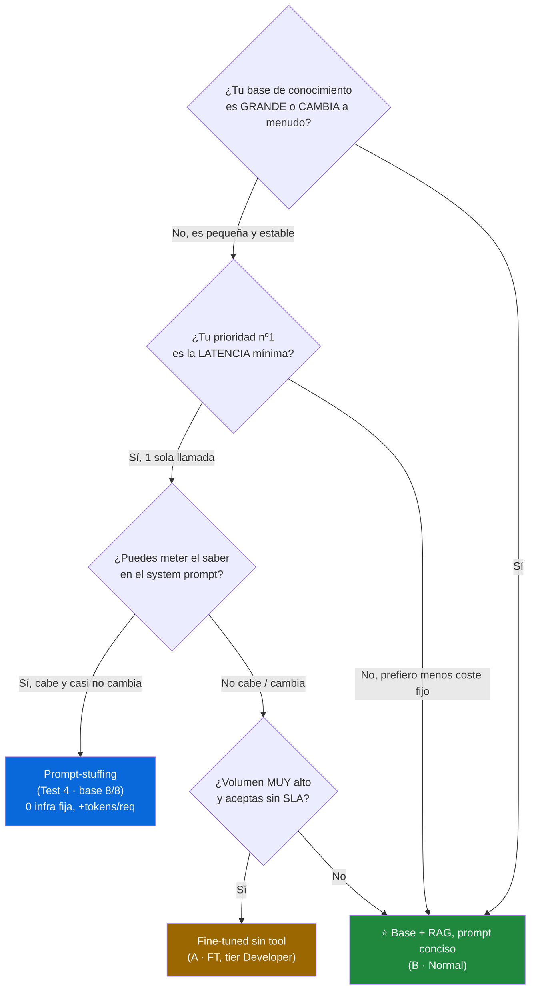

# Fine-tuning vs Tool: comparativa de un agente de soporte

Bundle autocontenido del experimento para el artículo. Compara el **mismo
modelo base `gpt-4o`** en versión normal y fine-tuned, con y sin tool, y su
optimización de prompt. Mismo dataset (8 preguntas) y mismo juez (`gpt-4o`).

## Empieza por aquí
- [docs/RESUMEN-final.md](docs/RESUMEN-final.md) — resumen consolidado, lectura global y recomendación.
- [docs/tokens-coste.md](docs/tokens-coste.md) — tokens de entrada/salida, coste y la **tabla de decisión** calidad-vs-coste.

## Las pruebas
| Test | Documento | Script | Idea |
|---|---|---|---|
| 1 | [docs/test1-llm-crudo.md](docs/test1-llm-crudo.md) | [scripts/compare_models.py](scripts/compare_models.py) | LLM crudo sin tool: ¿qué sabe en los pesos? |
| 2 | [docs/test2-agente.md](docs/test2-agente.md) | [scripts/compare_agents_tool.py](scripts/compare_agents_tool.py) | Mismo agente con tool `lookup_policy` |
| 3 | [docs/test3-optimizacion.md](docs/test3-optimizacion.md) | [scripts/optimize_compare.py](scripts/optimize_compare.py) | Optimización de prompt **con** tool |
| 4 | [docs/test4-llm-crudo-optimizado.md](docs/test4-llm-crudo-optimizado.md) | [scripts/optimize_compare.py](scripts/optimize_compare.py) `--no-tool` | Optimización de prompt **sin** tool (¿rescata al base?) |
| Coste | [docs/tokens-coste.md](docs/tokens-coste.md) | [scripts/token_report.py](scripts/token_report.py) | Tokens in/out, $/1k, latencia y TCO |

## Resultado en una línea
```
Sin tool   (Test 1):  fine-tuning IMPRESCINDIBLE    2.56 -> 4.44  (+73%)
Con tool   (Test 2):  fine-tuning aporta poco/resta  normal 8/8 vs FT 6/8
Optimizado (Test 3):  ambos llegan al techo CON tool 5.0 / 8-8
Sin tool+opt (Test 4): el optimizador INCRUSTA la política en el prompt
                       -> base 0/8 -> 8/8 (sólo si el saber es pequeño y estable)
Coste      (tokens):  base + tool conciso = mejor valor  $1.185/1k @ 8/8
Latencia   (lag):     sin tool = 1 llamada (~1.0-1.5s) · con tool = 2 llamadas + RAG
```

## Decisión (calidad + coste)
Ganador: **`gpt-4o` base + tool `lookup_policy` con prompt conciso** — 8/8 de
exactitud al menor coste ($1.185/1k), con una cuota fija de RAG pequeña
(Azure AI Search Basic ~$73.73/mes) y sin re-entrenar al cambiar una política. El
fine-tuning sólo gana sin tool/RAG, y aun así su **hosting fijo (~$1.241/mes)** lo
encarece ~17× frente al RAG: nicho económico muy estrecho.

## Árbol de decisión: ¿qué estrategia elijo?

Tres dimensiones deciden: **calidad** (¿acierta?), **coste total** (tokens + infra
fija) y **latencia** (¿cuántas llamadas/round-trips?). Responde a estas preguntas
en orden:



### Las preguntas, en claro (A o B)

1. **¿El conocimiento es grande o cambia a menudo?** (catálogos, precios, políticas
   que se editan). → **Sí: RAG (B·Normal).** Es lo único que escala a KBs grandes
   o vivas: actualizas el índice, no re-entrenas ni reescribes el prompt.
2. **Si es pequeño y estable, ¿tu prioridad es la latencia mínima?** El RAG/tool
   implica **2 llamadas secuenciales + recuperación** (~1.7 s + latencia del índice).
   Una sola llamada (~1.0-1.5 s) evita ese lag.
   - **Prefiero latencia → 1 llamada:** ¿el saber cabe en el system prompt?
     - **Sí → Prompt-stuffing (Test 4):** mete la política en el prompt; el base
       pasa a **8/8** con **cero infra fija** (sólo +tokens de entrada por petición).
     - **No cabe / sí cambia → fine-tuning sin tool**, pero sólo si el **volumen es
       muy alto** y aceptas el tier **Developer** (sin SLA, hosting $0). Con SLA, el
       hosting fijo (~$1.241/mes) lo hace caro: vuelve a RAG.
   - **Prefiero menor coste fijo → RAG (B·Normal).**

### Tabla de las estrategias frente a frente

| Estrategia | Calidad | $/1k tok | Infra fija/mes | Llamadas (lag) | Cuándo elegirla |
|---|:--:|:--:|:--:|:--:|---|
| **B · Base + RAG (conciso)** ⭐ | 8/8 | $1.185 | $73.73 (Search Basic) | 2 + recuperación | KB grande/viva; mejor valor global |
| Prompt-stuffing (Test 4) | 8/8\* | ~$1.4 | **$0** | **1** | KB pequeña y estable; latencia mínima, cero infra |
| FT sin tool (A · FT) | 6/8 | $1.092 | ~$1.241 (hosting) | **1** | sólo sin RAG, volumen muy alto, tier Developer |
| FT + tool (C · FT) | 8/8 | $3.092 | $73.73 + $1.241 | 2 + recuperación | ❌ lo peor de ambos mundos |

\* El 8/8 del prompt-stuffing depende de que la política **quepa** en el prompt y
sea **estable**: si crece o cambia seguido, los tokens de entrada se disparan y
vuelves a necesitar RAG. No "inventa" conocimiento: lo lleva *inline*.

> **Regla rápida:** *KB grande o viva* → **RAG (B·Normal)**. *KB pequeña y estable
> + latencia crítica* → **prompt-stuffing**. *Fine-tuning* casi nunca: sólo sin RAG,
> a gran volumen y sin SLA.

## Informe ampliado: tokens, coste y TCO

Detalle completo en [docs/tokens-coste.md](docs/tokens-coste.md). Resumen:

### Tokens por petición (media) — el coste lo domina la ENTRADA
| Escenario · Modelo | In | Out | Total | $/1k tokens |
|---|:--:|:--:|:--:|:--:|
| A · Normal (sin tool) | 98.8 | 74.1 | 172.9 | $0.988 |
| A · Fine-tuned (sin tool) | 98.8 | 48.1 | 146.9 | $1.092 |
| **B · Normal (tool conciso)** | 313.8 | 40.0 | **353.8** | **$1.185** |
| B · Fine-tuned (tool) | 313.8 | 61.6 | 375.4 | $2.101 |
| C · Normal (tool optimizado) | 573.8 | 40.1 | 613.9 | $1.835 |
| C · Fine-tuned (tool optimizado) | 647.8 | 44.2 | 692.0 | $3.092 |

La salida apenas se mueve (~40-74 tok); lo que dispara el coste es el prompt +
esquema de tool + texto de política. El prompt "optimizado" (C) **no mejora** la
exactitud sobre el conciso (B) y sólo añade input → más caro por el mismo 8/8.

### Latencia (lag) — el nº de llamadas manda
| Escenario · Modelo | Llamadas | 1ª llamada (med) | Total mediana |
|---|:--:|:--:|:--:|
| A · Normal (sin tool) | 1 | 1.440 ms | 1.440 ms |
| A · Fine-tuned (sin tool) | 1 | 1.039 ms | **1.039 ms** |
| B · Normal (tool conciso) | 2 | 743 ms | 1.611 ms |
| B · Fine-tuned (tool) | 2 | 583 ms | 1.752 ms |
| C · Normal (tool optimizado) | 2 | 509 ms | 1.606 ms |

Sin tool = **1 round-trip**; con tool/RAG = **2 round-trips secuenciales** y, en
producción, **+ la latencia de recuperación** de Azure AI Search (la `lookup_policy`
de la demo es un diccionario local ~0 ms). Por eso la latencia es el argumento que
equilibra la decisión hacia 1 sola llamada cuando el conocimiento es pequeño/estable.

### El RAG cuesta dinero… pero el fine-tuned cuesta mucho más

La opción "con tool" en producción implica un **RAG real (Azure AI Search)** con
cuota fija. Pero el fine-tuned también arrastra cuota fija: el **hosting del
deployment**. Precios públicos (eastus2):

| Componente fijo | Arquitectura | Coste fijo/mes |
|---|---|:--:|
| Azure AI Search **Basic** | RAG (B/C Normal) | **$73.73** |
| Azure AI Search **S1** (prod/SLA) | RAG alternativa | $245.28 |
| **Hosting fine-tuned** ($1.70/h × 730 h) | FT (A/B/C · FT) | **≈ $1.241** |
| Embeddings de consulta (`text-embedding-3-small`) | RAG | ≈ $0.7 @ 100k (despreciable) |

> 💡 La cuota fija del fine-tuned (~$1.241/mes) es **~17×** la de un Azure AI
> Search Basic (~$73.73/mes). Aun con S1 de producción ($245/mes), el RAG sigue
> siendo ~5× más barato en coste fijo.

### Coste total mensual (TCO = fijo + tokens)

| Arquitectura | Fijo/mes | 10k req | 100k req | 1M req |
|---|:--:|:--:|:--:|:--:|
| A · FT sin RAG | $1.241 | $1.252 | $1.350 | $2.333 |
| **B · Normal + RAG (tool conciso)** | **$73.73** | **$85.6** | **$192.2** | **$1.258,7** |
| C · Normal + RAG (tool optimizado) | $73.73 | $92.1 | $257.2 | $1.908,7 |
| C · FT + RAG (lo peor de ambos) | $1.314,7 | $1.345,6 | $1.623,9 | $4.406,7 |

**`gpt-4o` base + RAG (B·Normal) es el más barato en todos los volúmenes.** El
fine-tuned sin RAG parecía "la salida barata si no hay RAG", pero su hosting fijo
(~$1.241/mes) lo hace **~15× más caro que B·Normal a 10k req/mes**. El fine-tuning
sólo tendría sentido económico sin RAG, a volumen muy alto y en tier Developer
(sin SLA): un nicho muy estrecho.

> Precios de referencia (públicos, pueden variar): gpt-4o in $2.50 / out $10.00 por
> 1M tok; fine-tuned in $3.75 / out $15.00 por 1M tok + hosting $1.70/h; Azure AI
> Search Basic $73.73/mes, S1 $245.28/mes; `text-embedding-3-small` $0.022/1M tok.

## Contenido de la carpeta
- `docs/` — los 4 documentos de resultados (Markdown con tablas).
- `scripts/` — código del experimento:
  - `build_sft_dataset_tools.py` — genera el dataset SFT tool-aware.
  - `run_finetune.py` — lanza/gestiona el fine-tuning.
  - `ft_status.py`, `ft_events.py` — seguimiento del job de fine-tuning.
  - `compare_models.py` (Test 1), `compare_agents_tool.py` (Test 2), `optimize_compare.py` (Test 3).
  - `token_report.py` — mide tokens in/out por petición y coste por arquitectura.
- `data/` — dataset de evaluación (`support-eval.jsonl`) y datasets SFT con tool.
- `results/` — logs crudos de las ejecuciones.
- `infra/` — IaC y configuración del agente usados para reproducir el entorno
  (`main.bicep`, `resources.bicep`, `azure.yaml`, `agent.yaml`).

## Cómo reproducir (PowerShell)
```powershell
$env:PYTHONIOENCODING = "utf-8"
$env:FINETUNE_TOKEN    = az account get-access-token --scope "https://cognitiveservices.azure.com/.default" --query accessToken -o tsv
$env:FINETUNE_ENDPOINT = "https://aisvc-yrwwwokfuruzy.cognitiveservices.azure.com"

# Test 1 — LLM crudo
python scripts/compare_models.py --base gpt-4o --ft gpt-4o-ft --judge gpt-4o --out docs/test1-llm-crudo.md
# Test 2 — Agente con tool
python scripts/compare_agents_tool.py --normal gpt-4o --ft gpt-4o-ft --judge gpt-4o --out docs/test2-agente.md
# Test 3 — Optimización
python scripts/optimize_compare.py --normal gpt-4o --ft gpt-4o-ft --judge gpt-4o --optimizer gpt-5.1 --iterations 3 --out docs/test3-optimizacion.md
# Test 4 — Optimización SIN tool (¿rescata al base?)
python scripts/optimize_compare.py --normal gpt-4o --ft gpt-4o-ft --judge gpt-4o --optimizer gpt-5.1 --iterations 3 --no-tool --out docs/test4-llm-crudo-optimizado.md
# Tokens / coste / latencia
python articulo-finetuning-vs-tool/scripts/token_report.py --normal gpt-4o --ft gpt-4o-ft
```

> Nota: las rutas internas de los scripts apuntan al dataset original en
> `src/support-agent/data/`. Esta carpeta es una copia para el artículo; los
> scripts se ejecutan desde la raíz del repositorio.
