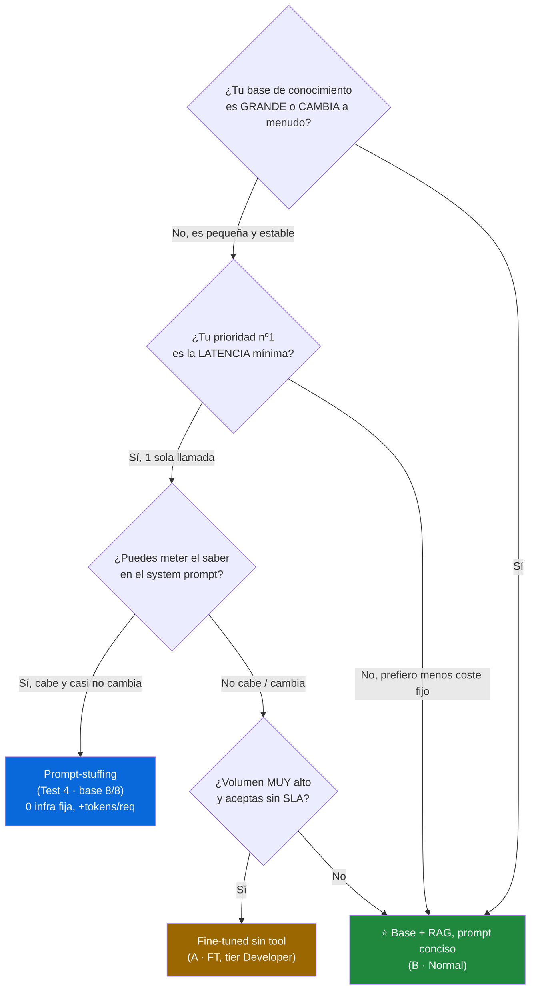

# Fine-tuning vs. Tool/RAG: qué le pasa de verdad a tu agente (con números)

> Un experimento de reconstrucción limpia sobre el **mismo** modelo base `gpt-4o`,
> medido en calidad, coste real y latencia. Sin humo: tokens exactos del campo
> `usage`, precios públicos de Azure y tiempos de pared medidos en cliente.

Hay una pregunta que aparece en casi todos los proyectos de agentes: *"¿afino el
modelo (fine-tuning) o le doy una herramienta/RAG para que consulte la
información?"*. Se responde con opiniones más que con datos, así que monté un
experimento para responderla **con números**.

La idea: un agente de soporte de una tienda con cuatro políticas fijas
(devoluciones, envío estándar, envío exprés y garantía). Cojo el **mismo** modelo
base `gpt-4o` y lo comparo consigo mismo en dos versiones —**normal** y
**fine-tuned**— bajo distintas arquitecturas. Mismo dataset de 8 preguntas, mismo
juez (`gpt-4o`), mismas condiciones. Una comparación justa.

---

## El montaje

| Pieza | Qué es |
|---|---|
| `gpt-4o` | Base normal (2024-11-20, GlobalStandard) |
| `gpt-4o-ft` | Fine-tuned desde `gpt-4o-2024-08-06` con 1.411 ejemplos (706 directos + 705 con tool) |
| `lookup_policy` | La "tool"/RAG: dado un tema, devuelve la política correcta |
| Juez `gpt-4o` | Puntúa relevancia + adherencia (1-5) contra la respuesta de referencia |

Sobre eso corrí **cuatro tests** que cubren la matriz completa: modelo
{normal, fine-tuned} × conocimiento {sin tool, con tool} × prompt {débil,
optimizado}.

---

## Test 1 — LLM crudo, sin herramienta: ¿qué sabe en sus pesos?

Pregunta directa al modelo, sin acceso a `lookup_policy`. Esto mide lo que el
modelo *lleva dentro*.

| Métrica | Normal | Fine-tuned | Δ |
|---|:--:|:--:|:--:|
| Global (1-5) | 2.56 | 4.44 | **+73 %** |
| Correctas (rel≥4) | **0/8** | **6/8** | +6 |

El modelo normal **se inventa las políticas**: no las tiene, así que alucina
fechas y precios. El fine-tuned las ha memorizado en sus pesos y acierta 6 de 8.

**Lección 1:** sin acceso a la información, el fine-tuning es la única forma de que
ese conocimiento viva en el modelo. Aquí el fine-tuning es **decisivo**.

---

## Test 2 — El mismo agente, ahora con herramienta

Le doy a **ambos** modelos la tool `lookup_policy`, que inyecta la política
correcta cuando la llaman.

| Métrica | Normal | Fine-tuned | Δ |
|---|:--:|:--:|:--:|
| Correctas (rel≥4) | **8/8** | 6/8 | −2 |
| Llama a la tool | 8/8 | 8/8 | = |
| Tokens medios | 358 | 375 | +17 |

Con la herramienta **se iguala el terreno**… y se da la vuelta. El modelo **normal
gana** (8/8 vs 6/8): es más conciso. El fine-tuned arrastra la verborrea que
aprendió en el entrenamiento, que el juez penaliza, y encima consume más tokens.

**Lección 2:** si hay tool/RAG fiable, el fine-tuning de conocimiento **aporta poco
y hasta resta**. El conocimiento ya entra por la herramienta; lo que el fine-tuning
añade (estilo aprendido) puede jugar en contra.

---

## Test 3 — Optimizar el prompt (con herramienta)

Partiendo de un prompt deliberadamente **débil** (`"You are a support bot. Answer
the customer's question."`), dejo que `gpt-5.1` reescriba el system prompt
iterativamente para cada modelo.

| Modelo | Combinada base | Optimizada | Correctas |
|---|:--:|:--:|:--:|
| Normal | 4.31 | **5.00** | 6/8 → 8/8 |
| Fine-tuned | 4.25 | **5.00** | 6/8 → 8/8 |

Con la tool disponible, **una sola iteración** lleva a los dos al techo (5.0, 8/8).
La optimización de prompt es barata y muy efectiva… *cuando el modelo ya tiene
acceso a la información correcta*.

**Lección 3:** optimizar el prompt cierra la diferencia entre normal y fine-tuned
casi al instante. Pero ojo: optimizar *para calidad* no es optimizar *para coste*
(lo vemos abajo).

---

## Test 4 — Optimizar el prompt SIN herramienta: el giro de guion

Esta es la combinación que faltaba y la que más me sorprendió. ¿Puede la
optimización de prompt **rescatar** al modelo base sin darle la tool?

| Modelo | Base | Optimizado |
|---|:--:|:--:|
| Normal `gpt-4o` | **0/8** | **8/8** |
| Fine-tuned | 5/8 | 7/8 |

¿El base pasó de 0/8 a 8/8 **sin** herramienta? Sí. Pero la explicación es la
parte interesante. El optimizador, al ver las respuestas de referencia durante la
optimización, **escribió las políticas reales dentro del system prompt**:

```text
STORE POLICIES (use these when relevant):
- Returns: 30 days from purchase, with receipt and original packaging.
- Express shipping: 24–48 h, +$9.99.
- Warranty: 2-year warranty against manufacturing defects.
...
```

El base no "aprendió" nada: el conocimiento estaba **inline** en el prompt. Eso
revela una **tercera estrategia de conocimiento** que casi nadie nombra:

> **Prompt-stuffing estático** — meter la base de conocimiento directamente en el
> system prompt. Funciona **solo si el conocimiento es pequeño y estable** (cabe en
> el prompt y casi no cambia). Coste: más tokens de entrada en *cada* petición,
> pero **cero infraestructura fija** (ni hosting de fine-tuning, ni RAG).

El fine-tuned, que ya lleva las políticas en sus pesos, solo mejoró de estilo
(5/8 → 7/8).

**Lección 4:** "no se puede promptear lo que el modelo no sabe" es verdad… salvo
que **metas tú el saber en el prompt**. Hay tres formas de dar conocimiento a un
modelo: **en los pesos** (fine-tuning), **por recuperación** (tool/RAG) o **inline
en el prompt** (prompt-stuffing). Cada una tiene su nicho.

---

## Ahora hablemos de dinero: tokens, coste e infraestructura

La calidad es solo un eje. En producción, lo que manda es el **coste total**. Medí
los tokens exactos por petición (campo `usage` de la API) y apliqué precios
públicos de Azure (eastus2).

### Tokens por petición — el coste lo domina la ENTRADA

| Escenario · Modelo | In | Out | Total | $/1k peticiones |
|---|:--:|:--:|:--:|:--:|
| A · Normal (sin tool) | 98.8 | 74.1 | 172.9 | $0.988 |
| A · Fine-tuned (sin tool) | 98.8 | 48.1 | 146.9 | $1.092 |
| **B · Normal (tool conciso)** | 313.8 | 40.0 | **353.8** | **$1.185** |
| B · Fine-tuned (tool) | 313.8 | 61.6 | 375.4 | $2.101 |
| C · Normal (tool optimizado) | 573.8 | 40.1 | 613.9 | $1.835 |
| C · Fine-tuned (tool optimizado) | 647.8 | 44.2 | 692.0 | $3.092 |

Dos cosas saltan a la vista:

1. **La salida casi no se mueve (~40-74 tok); lo que dispara el coste es la
   entrada** (prompt + esquema de la tool + texto de la política). El prompt
   "optimizado" (C) **no mejora** la exactitud sobre el conciso (B) y solo añade
   input → más caro por el mismo 8/8.
2. **El fine-tuned nunca ahorra**: consume tokens iguales o mayores y su precio por
   token es más alto.

### El RAG cuesta dinero… pero el fine-tuned cuesta mucho más

Aquí está la trampa que mucha gente olvida: **ni el RAG ni el fine-tuning son
gratis** en infraestructura fija, independiente del tráfico.

| Componente fijo | Arquitectura | Coste fijo/mes |
|---|---|:--:|
| Azure AI Search **Basic** | RAG (B/C · Normal) | **$73.73** |
| Azure AI Search **S1** (prod/SLA) | RAG alternativa | $245.28 |
| **Hosting fine-tuned** ($1.70/h × 730 h) | FT desplegado | **≈ $1.241** |

> 💡 La cuota fija del fine-tuned (~**$1.241/mes**) es **~17×** la de un Azure AI
> Search Basic (~$73.73/mes). Incluso con S1 de producción ($245/mes), el RAG sale
> ~5× más barato en coste fijo. *(El tier Developer de fine-tuning no cobra
> hosting, pero no tiene SLA: vale para dev/pruebas, no para producción.)*

### Coste total mensual (TCO = fijo + tokens)

| Arquitectura | Fijo/mes | 10k req | 100k req | 1M req |
|---|:--:|:--:|:--:|:--:|
| A · FT sin RAG | $1.241 | $1.252 | $1.350 | $2.333 |
| **B · Normal + RAG (tool conciso)** | **$73.73** | **$85.6** | **$192.2** | **$1.258,7** |
| C · Normal + RAG (tool optimizado) | $73.73 | $92.1 | $257.2 | $1.908,7 |
| C · FT + RAG (lo peor de ambos) | $1.314,7 | $1.345,6 | $1.623,9 | $4.406,7 |

**El modelo base + RAG con prompt conciso (B·Normal) es el más barato en TODOS los
volúmenes.** El fine-tuned sin RAG parecía "la salida barata si no hay RAG", pero
su hosting fijo lo hace **~15× más caro que B·Normal a 10k req/mes**.

---

## La dimensión olvidada: latencia (el lag)

Calidad y coste no bastan. Un agente lento es un agente que el usuario abandona.
Medí el **tiempo de pared real** por petición desde el cliente. (Las métricas de
plataforma `NormalizedTimeToFirstToken`/`TokensPerSecond` venían vacías porque las
llamadas son no-streaming, así que medí extremo a extremo.)

| Escenario | Llamadas | Total mediana |
|---|:--:|:--:|
| Sin tool (Fine-tuned) | 1 | **1.039 ms** |
| Sin tool (Normal) | 1 | 1.440 ms |
| Con tool (Normal) | 2 | 1.611 ms |
| Con tool (Fine-tuned) | 2 | 1.752 ms |

La clave es estructural: **el número de llamadas manda**.

- **Sin tool = 1 round-trip.** El usuario recibe la respuesta tras una sola ida y
  vuelta.
- **Con tool/RAG = 2 round-trips secuenciales** (decidir la tool → recibir el
  resultado → responder) **+ la latencia de recuperación** del índice real. En este
  experimento `lookup_policy` es un diccionario local (~0 ms); un Azure AI Search
  real suma típicamente +50-300 ms encima.

Y aquí el fine-tuned (o el prompt-stuffing) **se anota su único punto a favor**:
una sola llamada es estructuralmente más rápida. Si tu requisito es latencia
mínima y el conocimiento es pequeño, evitar el segundo round-trip importa.

---

## El árbol de decisión

Juntando los tres ejes —**calidad**, **coste total** y **latencia**— la decisión
deja de ser "fine-tuning sí o no" y se convierte en tres preguntas en orden:



### Las estrategias, frente a frente

| Estrategia | Calidad | $/1k tok | Infra fija/mes | Llamadas (lag) | Cuándo elegirla |
|---|:--:|:--:|:--:|:--:|---|
| **B · Base + RAG (conciso)** ⭐ | 8/8 | $1.185 | $73.73 | 2 + recuperación | KB grande/viva; mejor valor global |
| Prompt-stuffing (Test 4) | 8/8\* | ~$1.4 | **$0** | **1** | KB pequeña y estable; latencia mínima |
| FT sin tool (A · FT) | 6/8 | $1.092 | ~$1.241 | **1** | solo sin RAG, volumen muy alto, sin SLA |
| FT + tool (C · FT) | 8/8 | $3.092 | $73.73 + $1.241 | 2 + recuperación | ❌ lo peor de ambos mundos |

\* El 8/8 del prompt-stuffing depende de que la política **quepa** en el prompt y
sea **estable**. Si crece o cambia seguido, los tokens de entrada se disparan y
vuelves a necesitar RAG.

---

## Conclusiones

Después de cuatro tests, costes reales y latencia medida, la foto queda nítida:

1. **El conocimiento no se "promptea" si no está disponible.** El modelo base sin
   acceso a la información alucina (0/8). Necesitas dárselo de alguna forma.
2. **Hay tres formas de dar conocimiento**, no dos: en los pesos (fine-tuning), por
   recuperación (tool/RAG) o inline en el prompt (prompt-stuffing). El debate
   "fine-tuning vs RAG" se queda corto.
3. **Si tienes una tool/RAG fiable, el fine-tuning de conocimiento no compensa:**
   misma o peor calidad, más tokens, precio por token más alto y, encima, un
   hosting fijo (~$1.241/mes) que es ~17× el de un RAG Basic.
4. **El ganador para este caso es el modelo base + RAG con prompt conciso
   (B·Normal):** 8/8 de exactitud al menor coste total a cualquier volumen, y sin
   re-entrenar cada vez que cambia una política.
5. **El fine-tuning tiene un nicho real pero estrecho:** sin RAG, con conocimiento
   que no cabe en el prompt, a volumen muy alto y aceptando el tier Developer (sin
   SLA). Fuera de ahí, casi siempre pierde.
6. **La latencia equilibra la balanza** hacia una sola llamada (fine-tuning o
   prompt-stuffing) cuando el conocimiento es pequeño/estable y la velocidad manda.

La moraleja de fondo: **no afines un modelo para enseñarle datos que cambian.**
Para eso está la recuperación. Reserva el fine-tuning para enseñar *comportamiento*
(formato, estilo, estructura), no *hechos*.

---

### Reproducibilidad

Todo el experimento (scripts, datos, documentos y precios) está en el repositorio.
Cada test se reproduce con un comando:

```powershell
$env:PYTHONIOENCODING = "utf-8"
$env:FINETUNE_TOKEN    = az account get-access-token --scope "https://cognitiveservices.azure.com/.default" --query accessToken -o tsv
$env:FINETUNE_ENDPOINT = "https://aisvc-yrwwwokfuruzy.cognitiveservices.azure.com"

# Test 1 — LLM crudo
python scripts/compare_models.py --base gpt-4o --ft gpt-4o-ft --judge gpt-4o --out docs/test1-llm-crudo.md
# Test 2 — Agente con tool
python scripts/compare_agents_tool.py --normal gpt-4o --ft gpt-4o-ft --judge gpt-4o --out docs/test2-agente.md
# Test 3 — Optimización con tool
python scripts/optimize_compare.py --normal gpt-4o --ft gpt-4o-ft --judge gpt-4o --optimizer gpt-5.1 --iterations 3 --out docs/test3-optimizacion.md
# Test 4 — Optimización SIN tool
python scripts/optimize_compare.py --normal gpt-4o --ft gpt-4o-ft --judge gpt-4o --optimizer gpt-5.1 --iterations 3 --no-tool --out docs/test4-llm-crudo-optimizado.md
# Tokens / coste / latencia
python scripts/token_report.py --normal gpt-4o --ft gpt-4o-ft
```

> Precios de referencia (públicos, eastus2, pueden variar): `gpt-4o` in $2.50 / out
> $10.00 por 1M tok; fine-tuned in $3.75 / out $15.00 por 1M tok + hosting $1.70/h;
> Azure AI Search Basic $73.73/mes, S1 $245.28/mes; `text-embedding-3-small`
> $0.022/1M tok. La cifra de hosting del fine-tuned de `gpt-4o-2024-08-06` aparecía
> como "N/A" en el listado de la región, así que se usa el estándar de la familia
> ($1.70/h) como estimación.
